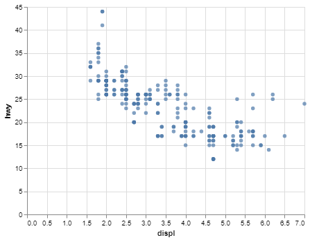

# Project Report 0: Introduction

__JACOB FARR__

## Project Summary

_In this project, I learned to reference the library website documentation for info on what methods the library offers and how those methods work. Two of those libraries were Pandas and Altair. Pandas was used to read a url with csv values and store the csv values for use in Python. Altair was used to create, print, and save a chart using the csv data pulled using Pandas._

#### Grand Question 1
I feel confident that I have prepared a working environment for class this semester.

#### Grand Question 2
Here is a copy of the chart I created with Altair using HTML to display the chart in Markdown:


## Appendix A
Python Code used in this project with justifications.

```python
# %%
# import pandas and altair libraries
# used to manipulate data in csv files
import pandas as pd
import altair as alt

# %%
# load 'miles per gallon' (mpg) data from a url
# simply stores the url in a variable
url = 'https://github.com/byuidatascience/data4python4ds/raw/master/data-raw/mpg/mpg.csv'

# %%
# read url to store csv data on mpg in a variable
# uses pandas (pd) method .read_csv(url) <--- url must contain csv
mpg = pd.read_csv(url)

# %%
# create a chart 
# uses altair (alt) method .Chart()
# create x and y values
# uses alt method .encode()
# define how marks are displayed
# uses alt method .mark_circle()
chart = (alt.Chart(mpg)
  .encode(
    x='displ', 
    y='hwy')
  .mark_circle()
)

# %%
# display the chart for debugging
chart

# %%
# save the chart as a png file
# uses altair_save method
chart.save("Images/chart.png")

```