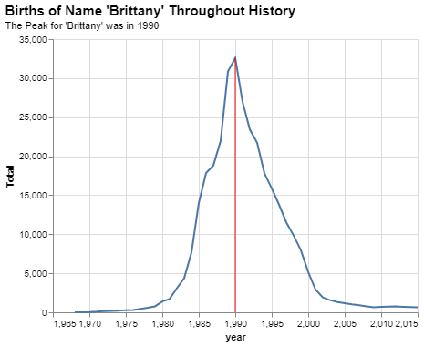

# Project 01: What's in a name?

__JACOB FARR__

## Project Summary

In Project 1, I queried a csv file of names from 1910-2015 to answer given questions. In order to accomplish this, I learned more Altair methods and properties. One notable methods is .query(), which uses boolean operators to select chosen variables from a selected DataFrame. Another notable method is .layer(), which is used to 'lay' charts on top of eachother to combine them into one. The last two notable methods are .configure_*() and .properties(), which allow me to modify and customize attributes of a given chart. The following is the result of successful attempts to answer the grand questions as they were proposed.

### __GRAND QUESTION 1__
#### _How does your name at your birth year compare to its use historically?_


I was born in the year 1998, which was the peak year for babies given the name 'Jacob' at their birth. You will notice a red line given to mark the year 1998, my birth year. This year happens to be the same year the name 'Jacob' peaked as a birth name. An interesting note is that the name 'Jacob' was not given to children very often before the 1970's. I wonder, what caused the numbers of occurances to rise?

### __GRAND QUESTION 2__
#### _If you talked to someone named Brittany on the phone, what is your guess of his or her age? What ages would you not guess?_




Based on the given charts, I would expect Brittany to have been born in the year 1990, but not before 1982 nor after 1998. That would mean I would guess Brittany to be about 31 years old. On the other hand, I would not guess Brittany to be older than 39 or younger than 23 years old since the occurence of the name Brittany is lower before 1982 and after 1998 than at the names' peak in 1990. Therefore, any guess between 23 and 39 years would be acceptable, but 31 years is the most likely answer.

Fun fact: Brittany Spears debuted in the late-1990's, so we might be able rule out that the birth name Brittany grew in popularity because of Brittany Spears' popular music.

### __GRAND QUESTION 3__
#### _Mary, Martha, Peter, and Paul are all Christian names. From 1920 to 2000, compare the name usage of each of the four names._


Over the course of time, Mary has consistently been a popular birth name, with Paul, Peter, and Martha being less popular but still well used. An interensting point to note is that after the 1950's, all these Christian names saw a steady decline in popularity. In modern day, these baby names have plateaued at an all time low popularity.

### __GRAND QUESTION 4__
#### _Think of a unique name from a famous movie. Plot the usage of that name and see how changes line up with the movie release._


This chart shows the usage of the name Harrison over time in relation to releases of Star Wars Episodes to see if the actor Harrison Ford, who is Han Solo in these movies, had an impact on the usage of the name Harrison. Each red line marks a year in which an episode of Star Wars was released. Han Solo (Harrison Ford), was only in episodes IV, V, VI, and VII, which released in the late 1970's, early 1980's, and 2015. At each point when a Star Wars episode with Han Solo was released, the birth name Harrison began to increase in its usage. The other episodes, which did not have Han Solo, were released in the late 1990's and 2000's and are not associated with an increase in the usage of Harrison as a birth name.

## Appendix A

_Here is my Python script, separated into four code segments... one for each grand question._

```python
'''
GRAND QUESTION 1
How does your name at your birth year compare to its use historically?

I was born in the year 1998, which was the peak year for babies given
the name 'Jacob' at their birth. My parents were totally unoriginal,
but I am grateful for the name I've been given.
'''
#%%
# load packages pandas and altair
import pandas as pd
import altair as alt

#%%
# load names data from url
url = "https://raw.githubusercontent.com/byuidatascience/data4names/master/data-raw/names_year/names_year.csv"
namesDataFrame = pd.read_csv(url)

#%%
# list the data types
namesDataFrame.dtypes

#%%
# show the original raw data
namesDataFrame

#%%
# build (query) DataFrame for Jacob from the namesDataFrame
name = namesDataFrame.query('name == "Felisha"')
name

#%%
# Calculate and print total names Oliver occurs in UT
Total = name['UT'].sum()
print(Total)

#%%
# build chart from 'name' DataFrame
name_chart = (alt.Chart(name)
    .encode(
        x = 'UT',
        y = 'Total'
    )
    .mark_bar()

    # add a title and subtitle to the chart
    # TO DO: move to layer method to see if it still works
    .properties(
        title = {
            "text": "Births of Name 'Jacob' Throughout History",
            "subtitle": "I was born in the year 1998"
        }
    )
)

name_chart
#%%
# build chart of peak year from 'name' DataFrame
# horizontal line created with .mark_rule() and name.query("year == 1998")
# this narrows the overlay chart to contain only data from the peak year
overlay = (alt.Chart(name.query("year == 1998"))
    .encode(
        # variables go here
            x = 'year',
            y = 'Total'
            # variables for .mark_point()
            #shape = 'year:N' # N = Nominal, O = Ordinal, (year is a variable)
            #color = 'name'
        )
    # attributes go here
    .mark_rule(color = 'red')
)
#%%
# layer, configure, and print name and overlay chart as one chart using alt.layer()
final_chart = (alt.layer(name_chart, overlay)
    .configure_title(
        fontSize = 15,
        anchor = "start",
        subtitleFontSize = 11
    )
)

final_chart 

#%%
# save the chart
final_chart.save("Images/birthYearChart.png")

```

```python
'''
GRAND QUESTION 2
If you talked to someone named Brittany on the phone, 
what is your guess of his or her age? What ages would 
you not guess?

Based on the given data, I would expect Brittany to have been
born in the year 1990, but not before 1982 or after 1998.

That would mean I guess Brittany to be about 31 years old, but
I would not guess Brittany to be older than 39 or younger than
23 years old since the occurence of the name Brittany is lower 
before 1982 and after 1998 than at the names' peak in 1990.

Any guess between 23 and 39 years old would be acceptable, but
31 years is the most likely answer.

Fun fact: Brittany Spears debuted in the late-1990's, so we can
rule out that the name Brittany became popular because of her.
'''
#%%
# load packages pandas and altair
import pandas as pd
import altair as alt

#%%
# load names data from url
url = "https://raw.githubusercontent.com/byuidatascience/data4names/master/data-raw/names_year/names_year.csv"
namesDataFrame = pd.read_csv(url)

#%%
# build (query) DataFrame for Brittany from the namesDataFrame
name = namesDataFrame.query('name == "Brittany"')

#%%
# build chart from 'name' DataFrame
name_chart = (alt.Chart(name)
    .encode(
        x = 'year',
        y = 'Total'
    )
    .mark_line()
)

#%%
# build charts of peak year and low years from Brittany 'name' DataFrame
# horizontal line created with .mark_rule() and name.query("year == 1990")
# this narrows the overlay chart to contain only data from the peak year
overlay_peakYear = (alt.Chart(name.query("year == 1990"))
    .encode(
        # variables go here
            x = 'year',
            y = 'Total',
            # variables for .mark_point()
            #shape = 'year:N' # N = Nominal, O = Ordinal, (year is a variable)
            #color = 'name'
        )
    # attributes go here
    .mark_rule(color = 'red')
)

overlay_lowYears = (alt.Chart(name.query("year == 1982 | year == 1998"))
    .encode(
        # variables go here
            x = 'year',
            y = 'Total',
            # variables for .mark_point()
            #shape = 'year:N' # N = Nominal, O = Ordinal, (year is a variable)
            #color = 'name'
        )
    # attributes go here
    .mark_rule(color = 'red')
)

#%%
# layer, configure, and print name and overlay chart as one chart using alt.layer()
# answers ages I would guess
finalChart_peak = (alt.layer(name_chart, overlay_peakYear)
    .configure_title(
        fontSize = 15,
        anchor = "start",
        subtitleFontSize = 11
    )
    # add a title and subtitle to the chart
    .properties(
        title = {
            "text": "Births of Name 'Brittany' Throughout History",
            "subtitle": "The Peak for 'Brittany' was in 1990"
        }
    )
)

finalChart_peak

#%%
# layer, configure, and print name and overlay chart as one chart using alt.layer()
# answers ages I would not guess
finalChart_low = (alt.layer(name_chart, overlay_lowYears)
    .configure_title(
        fontSize = 15,
        anchor = "start",
        subtitleFontSize = 11
    )
    # add a title and subtitle to the chart
    .properties(
        title = {
            "text": "Births of Name 'Brittany' Throughout History",
            "subtitle": "The Lows for 'Brittany' are before 1982 and after 1998"
        }
    )
)

finalChart_low

#%%
# save the peak chart (would guess)
finalChart_peak.save("Images/peakBrittanyChart.png")

#%%
# save the low chart (would not guess)
finalChart_low.save("Images/lowBrittanyChart.png")

```

```python
'''
GRAND QUESTION 3
Mary, Martha, Peter, and Paul are all Christian names. From 1920 
to 2000, compare the name usage of each of the four names.
'''
### TO DO: Add a legend to the final chart.

#%%
# load packages pandas and altair
import pandas as pd
import altair as alt

#%%
# load names data from url
url = "https://raw.githubusercontent.com/byuidatascience/data4names/master/data-raw/names_year/names_year.csv"
namesDataFrame = pd.read_csv(url)

#%%
# read data types
namesDataFrame.dtypes

#%%
# build (query) DataFrame for christianNames from the namesDataFrame
christianNames = namesDataFrame.query('name == "Mary" | name == "Martha" | name == "Peter" | name == "Paul"')

#%%
# build (query) christianNames for Mary, Martha, Peter, and Paul
nameMary = christianNames.query('name == "Mary"')
nameMartha = christianNames.query('name == "Martha"')
namePeter = christianNames.query('name == "Peter"')
namePaul = christianNames.query('name == "Paul"')

#%%
# create Mary overlay chart
overlay_Mary = (alt.Chart(nameMary)
    .encode(
        # variables go here
        x = 'year',
        y = 'Total',
        # variables for .mark_point()
        #shape = 'year:N' # N = Nominal, O = Ordinal, (year is a variable)
        color = 'name'
    )
    # attributes go here
    .mark_line()
)

#%%
# create Martha overlay chart
overlay_Martha = (alt.Chart(nameMartha)
    .encode(
        # variables go here
        x = 'year',
        y = 'Total',
        # variables for .mark_point()
        #shape = 'year:N' # N = Nominal, O = Ordinal, (year is a variable)
        color = 'name'
    )
    # attributes go here
    .mark_line()
)

#%%
# create Peter overlay chart
overlay_Peter = (alt.Chart(namePeter)
    .encode(
        # variables go here
        x = 'year',
        y = 'Total',
        # variables for .mark_point()
        #shape = 'year:N' # N = Nominal, O = Ordinal, (year is a variable)
        color = 'name'
    )
    # attributes go here
    .mark_line()
)

#%%
# create Paul overlay chart
overlay_Paul = (alt.Chart(namePaul)
    .encode(
        # variables go here
        x = 'year',
        y = 'Total',
        # variables for .mark_point()
        #shape = 'year:N' # N = Nominal, O = Ordinal, (year is a variable)
        color = 'name'
    )
    # attributes go here
    .mark_line()
)

#%%
# layer, configure, and print all charts as one chart using alt.layer()
# answers ages I would guess
finalChart = (alt.layer(overlay_Mary, overlay_Martha, overlay_Peter, overlay_Paul)
    .configure_title(
        fontSize = 15,
        anchor = "start",
        subtitleFontSize = 11
    )
    # give the final chart a title
    .properties(
        title = {
            "text": "Births of Christian Names from 1920 to 2000",
            "subtitle": "Compares Names Mary, Martha, Peter, and Paul"
        }
    )
)

finalChart

#%%
# save the christian names chart
finalChart.save("Images/christianNamesChart.png")

```

```python
'''
GRAND QUESTION 4
Think of a unique name from a famous movie. Plot the usage of 
that name and see how changes line up with the movie release.

The name I chose was Harrison, after the actor Harrison Ford.
I plotted the usage of his first name every time a Star Wars
Episode is released. According to the Data, there seem to be
both upward and downward trends of the birth name Harrison
when a Star Wars Episode is released. This makes sense with
the middle three, since those Episodes did not include the 
actor Harrison Ford. However, every episode which includes 
Harrison Ford is associated with an upward trend in the usage
of the birth name Harrison. Are the two connected? Maybe!
'''
#%%
# load packages pandas and altair
import pandas as pd
import altair as alt

#%%
# load names data from url
url = "https://raw.githubusercontent.com/byuidatascience/data4names/master/data-raw/names_year/names_year.csv"
namesDataFrame = pd.read_csv(url)

#%%
# build (query) DataFrame for Harrison from the namesDataFrame
name = namesDataFrame.query('name == "Harrison"')

#%%
# build chart from 'name' DataFrame
name_chart = (alt.Chart(name)
    .encode(
        x = 'year',
        y = 'Total'
    )
    .mark_line()
)

#%%
# build overlay charts of Star Wars Episode release years
# horizontal line created with .mark_rule() and name.query("year == 1990")
# this narrows the overlay chart to contain only data from the release year
release_episodeIV = (alt.Chart(name.query("year == 1977"))
    .encode(
        # variables go here
            x = 'year',
            y = 'Total',
            # variables for .mark_point()
            #shape = 'year:N' # N = Nominal, O = Ordinal, (year is a variable)
        )
    # attributes go here
    .mark_rule(color = 'red')
)

release_episodeV = (alt.Chart(name.query("year == 1980"))
    .encode(
        # variables go here
            x = 'year',
            y = 'Total',
            # variables for .mark_point()
            #shape = 'year:N' # N = Nominal, O = Ordinal, (year is a variable)
        )
    # attributes go here
    .mark_rule(color = 'red')
)

release_episodeVI = (alt.Chart(name.query("year == 1983"))
    .encode(
        # variables go here
            x = 'year',
            y = 'Total',
            # variables for .mark_point()
            #shape = 'year:N' # N = Nominal, O = Ordinal, (year is a variable)
        )
    # attributes go here
    .mark_rule(color = 'red')
)

release_episodeI = (alt.Chart(name.query("year == 1999"))
    .encode(
        # variables go here
            x = 'year',
            y = 'Total',
            # variables for .mark_point()
            #shape = 'year:N' # N = Nominal, O = Ordinal, (year is a variable)
        )
    # attributes go here
    .mark_rule(color = 'red')
)

release_episodeII = (alt.Chart(name.query("year == 2002"))
    .encode(
        # variables go here
            x = 'year',
            y = 'Total',
            # variables for .mark_point()
            #shape = 'year:N' # N = Nominal, O = Ordinal, (year is a variable)
        )
    # attributes go here
    .mark_rule(color = 'red')
)

release_episodeIII = (alt.Chart(name.query("year == 2005"))
    .encode(
        # variables go here
            x = 'year',
            y = 'Total',
            # variables for .mark_point()
            #shape = 'year:N' # N = Nominal, O = Ordinal, (year is a variable)
        )
    # attributes go here
    .mark_rule(color = 'red')
)

release_episodeVII = (alt.Chart(name.query("year == 2015"))
    .encode(
        # variables go here
            x = 'year',
            y = 'Total',
            # variables for .mark_point()
            #shape = 'year:N' # N = Nominal, O = Ordinal, (year is a variable)
        )
    # attributes go here
    .mark_rule(color = 'red')
)

#%%
# layer, configure, and print name and overlay chart as one chart using alt.layer()
# answers ages I would guess
finalChart = (alt.layer(name_chart, release_episodeI, release_episodeII, release_episodeIII, release_episodeIV, release_episodeV, release_episodeVI, release_episodeVII)
    .configure_title(
        fontSize = 15,
        anchor = "start",
        subtitleFontSize = 11
    )
    # add a title and subtitle to the chart
    .properties(
        title = {
            "text": "Births of Name 'Harrison' When Star Wars Movies Debuted",
            "subtitle": "Release years marked for Star Wars Episode I to Episode VII"
        }
    )
)

finalChart

#%%
# save the peak chart (would guess)
finalChart.save("Images/starWarsChart.png")

```