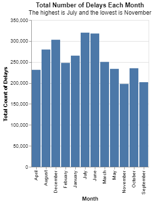
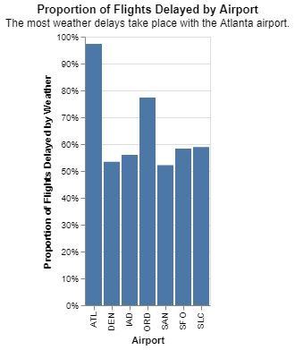

# Project 2: Are we missing JSON on our Flight?

__Jacob Farr__

## Project Summary

_In this project, I learned new methods for manipulating DataFrames using data imported from a JSON file instead of a CSV file. The first method was groupby(), which organizes the dataframe by the observations in a chosen column. Other specific methods include .agg() and .assign(), which are used to create new columns in a dataframe. Within the .assign() method, I learned how to use lambda functions to perform mathematical operations in creating new columns. Using the .isin() method, I selected specific observations within a column in order to narrow down a range of rows randomly placed throughout the dataset and perform mathematical operations on those rows. Finally, the .replace() method was used to replace inconsistent missing data with a more consistent standard for null cells, which is NaN. This data was promptly exported as a new JSON file to ensure more accurate observations in the future.

## Technical Details


#### Grand Question 1
Which airport has the worst delays? Discuss how you chose to define “worst”. Your answer should also include a table that lists (for each airport) the total number of flights, total number of delayed flights, proportion of delayed flights, and average delay time in hours.

| airport_code   |    flights_total |   delays_total |   minutes_total |   percent_delays |   average_hours |
|:---------------|-----------------:|---------------:|----------------:|-----------------:|----------------:|
| ATL            |      4.43005e+06 |         902443 |     5.39839e+07 |         0.20371  |        0.996996 |
| DEN            |      2.51397e+06 |         468519 |     2.51734e+07 |         0.186366 |        0.895495 |
| IAD            | 851571           |         168467 |     1.02835e+07 |         0.197831 |        1.01736  |
| ORD            |      3.59759e+06 |         830825 |     5.63561e+07 |         0.230939 |        1.13053  |
| SAN            | 917862           |         175132 |     8.27625e+06 |         0.190804 |        0.78762  |
| SFO            |      1.63094e+06 |         425604 |     2.65505e+07 |         0.260955 |        1.03972  |
| SLC            |      1.40338e+06 |         205160 |     1.01234e+07 |         0.146189 |        0.822396 |

*I chose to define the "worst" delay as the delay with the longest average wait time. In the table above, the longest wait time is labeled as average_hours. According to this definition, the Orlando (ORD) airport has the "worst" delays.*

*However, one could also define the airport with the "worst" delays as the airport most likely to have a delay. In the table above, percent_delays represents how many flights are delayed at each airport. By this definition, the San Francisco (SFO) airport has the "worst" delays.*

*Thus, the data suggests either the San Francisco airport or the Orlando airport has the worst delays.*

#### Grand Question 2
What is the best month to fly if you want to avoid delays of any length? Discuss your answer. Include one chart to help support your answer, with the x-axis ordered by month. (To answer this question, you will need to remove any rows that are missing the Month variable.)



*The best month to fly to avoid delays of any length is November. I chose this month based on the chart above, which shows the total number of delays each month. If the total count of delays in November is lower than any other month, then the chances of a delay happening in November is also less than any other month. Therefore, November is the best month to fly in order to avoid delays of any length because the total count of delays is lowest in November.*

#### Grand Question 3
According to the BTS website the “Weather”” category only accounts for severe weather delays. Mild weather delays are not counted in the “Weather” category, but are actually included in both the “NAS” and “Late-Arriving Aircraft” categories. Your job is to create a new column that calculates the total number of flights delayed by weather (either severe or mild). You will need to replace all the missing values in the Late Aircraft variable with the mean. Use these two rules for your calculations:

a. 30% of all delayed flights in the Late-Arriving category are due to weather.
b. From April to August, 40% of delayed flights in the NAS category are due to weather. The rest of the months, the proportion rises to 65%.

|    | airport_code   | month   |   severe |   mild_late |   mild_nas |   total_weather |   total_late |   percent_weather |   total_weather_sum |
|---:|:---------------|:--------|---------:|------------:|-----------:|----------------:|-------------:|------------------:|--------------------:|
|  0 | ATL            | January |      448 |      -299.7 |    2988.7  |         3137    |         4047 |          0.775142 |         1.06827e+06 |
|  1 | DEN            | January |      233 |       278.4 |     607.75 |         1119.15 |         2096 |          0.533946 |         1.06827e+06 |
|  2 | IAD            | January |       61 |       317.4 |     581.75 |          960.15 |         2014 |          0.476738 |         1.06827e+06 |
|  3 | ORD            | January |      306 |       676.5 |    3519.75 |         4502.25 |         7976 |          0.564475 |         1.06827e+06 |
|  4 | SAN            | January |       56 |       204   |     414.7  |          674.7  |         1374 |          0.491048 |         1.06827e+06 |

*The total number of flights delayed by weather is labeled as total_weather_sum, which number is 1,068,267 flights delayed by weather.*

#### Grand Question 4
Create a barplot showing the proportion of all flights that are delayed by weather at each airport. Discuss what you learn from this graph.



*This chart shows that the Atlanta airport has the worst ratio of delays caused by weather, meaning we can expect the majority of flight delays having to do with weather occur at the Atlanta airport. On the other hand, the chart shows that Denver and San Francisco have the lowest likelihood of having a flight delayed due to weather.*

#### Grand Question 5
Fix all of the varied missing data types in the data to be consistent (all missing values should be displayed as “NaN”) and save the new data as a JSON file. Include one record example from your exported JSON file that has a missing value.
[
&emsp;{
        &emsp;&emsp;"index": 911,
        &emsp;&emsp;"airport_code": "DEN",
        &emsp;&emsp;"airport_name": null,
        &emsp;&emsp;"month": "November",
        &emsp;&emsp;"year": 2015.0,
        &emsp;&emsp;"num_of_flights_total": 17120,
        &emsp;&emsp;"num_of_delays_carrier": "751",
        &emsp;&emsp;"num_of_delays_late_aircraft": 1031.0,
        &emsp;&emsp;"num_of_delays_nas": 1197,
        &emsp;&emsp;"num_of_delays_security": 1,
        &emsp;&emsp;"num_of_delays_weather": 93,
        &emsp;&emsp;"num_of_delays_total": 3076,
        &emsp;&emsp;"minutes_delayed_carrier": 54704.0,
        &emsp;&emsp;"minutes_delayed_late_aircraft": 69918,
        &emsp;&emsp;"minutes_delayed_nas": 50919.0,
        &emsp;&emsp;"minutes_delayed_security": 63,
        &emsp;&emsp;"minutes_delayed_weather": 9509,
        &emsp;&emsp;"minutes_delayed_total": 185113
&emsp;},
]

## Appendix A

_Code for Question 1_

```python
#%%
# import packages
import altair as alt
import pandas as pd
import numpy as np

#%%
# from json url to pandas dataframe
url = "https://github.com/byuidatascience/data4missing/raw/master/data-raw/flights_missing/flights_missing.json"
flights = pd.read_json(url)

# GRAND QUESTION 1
# I chose to define the "worst" delay as the delay with the longest average wait time.
# In my dataframe, the longest wait time is labeled as average_hours. According to this
# definition, the Orlando (ORD) airport has the "worst" delays.

#%%
# What data are we dealing with?
flights.columns

#%%
# Create a new data frame containing all data pertaining to delays.
worst_delays = (flights
    .groupby('airport_code') # group the data by airport to identify delay data for each airport
        .agg(
            flights_total = ('num_of_flights_total', sum), # sum up all flights for each airport
            delays_total = ('num_of_delays_total', sum), # sum up all delays for each airport
            minutes_total = ('minutes_delayed_total', sum) # sum up all minuted delayed for each airport
        )
        .assign(
            percent_delays = lambda x: x.delays_total / x.flights_total,
            average_hours = lambda x: (x.minutes_total / x.delays_total) / 60
        )
    )

worst_delays

#%%
print(worst_delays.to_markdown())

# %%

```

_Code for Question 2_

```python
#%%
# import packages
import altair as alt
import pandas as pd
import numpy as np

#%%
# from json url to pandas dataframe
url = "https://github.com/byuidatascience/data4missing/raw/master/data-raw/flights_missing/flights_missing.json"
flights = pd.read_json(url)

# GRAND QUESTION 2
# The best month to fly to avoid delays of any length is November. I chose this month based on the chart I created,
# which shows the total number of delays each month. If the total count of delays in any given month is lower than
# any other month, then the chances of a delay happening in that month is also less than any other month. Therefore, 
# November is the best month to fly in order to avoid delays of any length because the total count of delays is lowest in November.

#%%
# What data are we dealing with?
flights.columns

# %%
# Create a new data frame containing all data pertaining to delays, 
# but group by month instead of by airport.
best_months = (flights
    .groupby('month')
        .agg(
            flights_total = ('num_of_flights_total', sum),
            delays_total = ('num_of_delays_total', sum),
            minutes_total = ('minutes_delayed_total', sum)
        )
        .assign(
            percent_delays = lambda x: x.delays_total / x.flights_total,
            average_hours = lambda x: x.minutes_total / x.delays_total / 60
        )
        .reset_index()
        .drop(labels=12, axis=0)
    )

best_months

# %%
# include one chart to help support your answer
best_month_chart = alt.Chart(best_months).mark_bar().encode(
    x = alt.X('month', axis=alt.Axis(title='Month')),
    y = alt.Y('delays_total', axis=alt.Axis(title='Total Count of Delays'))
).properties(
    title = {
        "text":"Total Number of Delays Each Month",
        "subtitle":"The highest is July and the lowest is November"
    }
)

best_month_chart

#%%
# save the chart
best_month_chart.save("Images/best_month_chart.png")

# %%

```

_Code for Question 3 and 4_

```python
#%%
# import packages
import altair as alt
import pandas as pd
import numpy as np

#%%
# from json url to pandas dataframe
url = "https://github.com/byuidatascience/data4missing/raw/master/data-raw/flights_missing/flights_missing.json"
flights = pd.read_json(url)

# GRAND QUESTION 3
# The Total Number of Flights Delayed by Weather: 1,068,267 flights delayed

#%%
# What data are we dealing with?
flights.columns

#%%
# create a weather delays dataframe
weather_delays = (flights
    .assign(
        # select all missing values in num_of_delays_late_aircraft and replace with the mean
        severe = lambda x: x.num_of_delays_weather.replace(-999, x.num_of_delays_weather.mean()),
        # calculate 30% of late-arriving aircraft to find mild weather delays
        mild_late = lambda x: x.num_of_delays_late_aircraft * .30,
        # calculate 40% of nas flights from Apr - Aug and 65% otherwise to find mild weather delays
        mild_nas = lambda x: np.where(
            x.month.isin(["April", "May", "June", "July", "August"]),
            x.num_of_delays_nas * .40,
            x.num_of_delays_nas * .65),
        # calculate today weather delays for each observation (row)
        total_weather = lambda x: x.severe + x.mild_late + x.mild_nas,
        # calculate total late aircraft to help calculate which proportion (percent) of late aircraft are due to weather
        total_late = lambda x: x.num_of_delays_weather + x.num_of_delays_late_aircraft + x.num_of_delays_nas,
        # calculate which proportion (percent) of late aircraft are due to weather
        percent_weather = lambda x: x.total_weather / x.total_late,
        # calculate the actual number we're looking for... total number of flights delayed by weather
        total_weather_sum = lambda x: sum(x.severe) + sum(x.mild_late) + sum(x.mild_nas),
    )
    .filter(
        ['airport_code', 'month', 'severe','mild_late','mild_nas', 'total_weather', 'total_late', 'percent_weather', 'total_weather_sum']
    )
)

weather_delays

#%%
# What is the total number of flights delayed by any weather?
print(weather_delays['total_weather_sum']) # 1068267.05

# GRAND QUESTION 4
# This chart shows that the Atlanta airport has the worst ratio of delays caused by weather, meaning we can
# expect the majority of delays have to do with weather for flights involving the Atlanta airport.

#%%
# create a barplot showing the proportion of all flights delayed by weather at each airport
weather_chart = alt.Chart(weather_delays).mark_bar().encode(
    x = alt.X('airport_code', axis=alt.Axis(title='Airport')),
    y = alt.Y('percent_weather', axis=alt.Axis(format="%", title='Proportion of Flights Delayed by Weather'))
).properties(
    title = {
        "text":"Proportion of Flights Delayed by Airport",
        "subtitle":"The most weather delays take place with the Atlanta airport."
    }
)

weather_chart.save("Images/weather_chart.png")

# %%

```

_Code for Question 5_

```python
#%%
# import packages
import altair as alt
import pandas as pd
import numpy as np

#%%
# from json url to pandas dataframe
url = "https://github.com/byuidatascience/data4missing/raw/master/data-raw/flights_missing/flights_missing.json"
flights = pd.read_json(url)

# GRAND QUESTION 5

#%%
# Fix all of the varied missing data types in the data to be consistent
# (all missing values should be displayed as "NaN") and save the new data
# as a JSON file.

# columns with missing data: airport_name (empty cells), month (n/a), year (nan), num_of_delays_late_aircraft (-999), 
# minutes_delayed_carrier (nan), minutes_delayed_nas (nan AND -999)

# Reformat the missing values
flights_new = flights.replace('', np.nan).replace('n/a', np.nan).replace(-999, np.nan)

# %%
# Compare with the original to ensure the reformat worked
flights.isnull().sum()

#%%
# Did the reformat work?
# If the system detects more null cells, Yes!
flights_new.isnull().sum()

#%%
# save the fixed flights data as a json file
flights_new.to_json("fixed_flights_data")

```