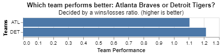

# Project 3: Finding Relationships in Baseball

__JACOB FARR__

## Project Summary

_Used datadotworld python library to create SQL queries in python to access a relational database containing baseball data. Accessed the tables and columns in the database to create new dataframes using SQL. Also used SQL to manipulate the data within the new tables. Applied Altair Chart methods to create visualizations from SQL queried dataframes. SQL Methods Utilized: SELECT, FROM, JOIN, WHERE, GROUP BY, ORDER BY, LIMIT_

### Grand Question 1
Write an SQL query to create a new dataframe about baseball players who attended BYU-Idaho. The new table should contain five columns: playerID, schoolID, salary, and the yearID/teamID associated with each salary. Order the table by salary (highest to lowest) and print out the table in your report.


#### Baseball Players Who Attended BYU-Idaho Ordered By Salary (highest to lowest)
|    | playerID   | schoolID   |   salary |   yearID | teamID   |
|---:|:-----------|:-----------|---------:|---------:|:---------|
|  0 | lindsma01  | idbyuid    |  4000000 |     2014 | CHA      |
|  1 | lindsma01  | idbyuid    |  3600000 |     2012 | BAL      |
|  2 | lindsma01  | idbyuid    |  2800000 |     2011 | COL      |
|  3 | lindsma01  | idbyuid    |  2300000 |     2013 | CHA      |
|  4 | lindsma01  | idbyuid    |  1625000 |     2010 | HOU      |
|  5 | stephga01  | idbyuid    |  1025000 |     2001 | SLN      |
|  6 | stephga01  | idbyuid    |   900000 |     2002 | SLN      |
|  7 | stephga01  | idbyuid    |   800000 |     2003 | SLN      |
|  8 | stephga01  | idbyuid    |   550000 |     2000 | SLN      |
|  9 | lindsma01  | idbyuid    |   410000 |     2009 | FLO      |
| 10 | lindsma01  | idbyuid    |   395000 |     2008 | FLO      |
| 11 | lindsma01  | idbyuid    |   380000 |     2007 | FLO      |
| 12 | stephga01  | idbyuid    |   215000 |     1999 | SLN      |
| 13 | stephga01  | idbyuid    |   185000 |     1998 | PHI      |
| 14 | stephga01  | idbyuid    |   150000 |     1997 | PHI      |

*The table above may appear to be ordered by playerID, but I assure you it is not. It just happens to line up that way.*

### Grand Question 2
This three-part question requires you to calculate batting average (number of hits divided by the number of at-bats)

a. Write an SQL query that provides playerID, yearID, and batting average for players with at least 1 at bat. Sort the table from highest batting average to lowest, and show the top 5 results in your report.

#### Top 5 Batting Averages For Players With At Least 1 At Bat
|    | playerID   |   yearID |   H |   AB |   BattingAVG |
|---:|:-----------|---------:|----:|-----:|-------------:|
|  0 | simspe01   |     1915 |   1 |    1 |            1 |
|  1 | knollhu01  |     1906 |   1 |    1 |            1 |
|  2 | altroni01  |     1929 |   1 |    1 |            1 |
|  3 | gastowe01  |     1899 |   1 |    1 |            1 |
|  4 | lambeot01  |     1918 |   1 |    1 |            1 |

b. Write an SQL query that provides playerID, yearID, and batting average for players with at least 10 at bats. Sort the table from highest batting average to lowest, and show the top 5 results in your report.

#### Top 5 Batting Averages For Players With At Least 10 At Bats
|    | playerID   |   yearID |   H |   AB |   BattingAVG |
|---:|:-----------|---------:|----:|-----:|-------------:|
|  0 | nymanny01  |     1974 |   9 |   14 |     0.642857 |
|  1 | carsoma01  |     2013 |   7 |   11 |     0.636364 |
|  2 | johnsde01  |     1975 |   6 |   10 |     0.6      |
|  3 | altizda01  |     1910 |   6 |   10 |     0.6      |
|  4 | silvech01  |     1948 |   8 |   14 |     0.571429 |

c. Now calculate the batting average for players over their entire careers (all years combined). Only include players with at least 100 at bats, and print the top 5 results.

#### Top 5 Batting Averages For Players With At Least 100 At Bats
|    | playerID   |   H |   AB |   BattingAVG |
|---:|:-----------|----:|-----:|-------------:|
|  0 | meyerle01  |  64 |  130 |     0.492308 |
|  1 | mcveyca01  |  66 |  153 |     0.431373 |
|  2 | jacksjo01  | 233 |  571 |     0.408056 |
|  3 | hazlebo01  |  54 |  134 |     0.402985 |
|  4 | barnero01  |  63 |  157 |     0.401274 |

*Grouped By playerID to calculate batting averages over entire careers.*

### Grand Question 3
Pick any two baseball teams and compare them using a metric of your choice (average salary, home runs, number of wins, etc). Write an SQL query to get the data you need, then make a graph in Altair to visualize the comparison. (You can use python if additional data wrangling is needed to prep the data for Altair.)

#### Dataframe Comparing Wins And Losses of Atlanta Braves and Detroit Tigers
|    | teamID   |   Wins |   Losses |   Win_Loss_Ratio |
|---:|:---------|-------:|---------:|-----------------:|
|  0 | ATL      |     85 |       77 |          1.1039  |
|  1 | DET      |     74 |       61 |          1.21311 |

#### Altair Chart Comparing Wins And Losses of Atlanta Braves and Detroit Tigers



## Appendix A

Commented code written for Grand Question 1
```python
#%%
# import packages
import datadotworld as dw

# GRAND QUESTION 1

#%%
# Query byuidss/cse-250-baseball-database CollegePlaying and Salaries tables as one dataframe
# Include CollegePlaying.playerID, CollegePlaying.schoolID, Salaries.salary, Salaries.yearID, Salaries.teamID
# Only include baseball players who attended BYU-Idaho
# Order by salary (highest to lowest)
# TODO: Include the table in your Markdown report

baseball_byuIdaho = dw.query('byuidss/cse-250-baseball-database',
    '''
    SELECT DISTINCT CollegePlaying.playerID,
        CollegePlaying.schoolID,
        Salaries.salary,
        Salaries.yearID,
        Salaries.teamID
    FROM CollegePlaying
        JOIN Salaries 
            ON CollegePlaying.playerID = Salaries.playerID
    WHERE CollegePlaying.schoolID = "idbyuid"
    ORDER BY Salaries.salary DESC
    '''
).dataframe

print(baseball_byuIdaho.to_markdown())

# %%

```

Commented code written for Grand Question 2
```python
#%%
# import packages
import datadotworld as dw

# GRAND QUESTION 2

#%%
# PART A
# Batting Average == player's hits (H) / player's at-bats (AB)
# Query Batting.playerID, Batting.yearID, and batting average (Batting.H / Batting.AB)
# Only include players with AT LEAST 1 BAT
# Order by batting average (highest to lowest) and only show top 5 results
batting_avg_A = dw.query('byuidss/cse-250-baseball-database',
    '''
    SELECT DISTINCT Batting.playerID,
        Batting.yearID,
        (Batting.H / Batting.AB) AS BattingAVG
    FROM Batting
    WHERE Batting.AB >= 1
    ORDER BY BattingAVG DESC
    LIMIT 5
    '''
).dataframe

print(batting_avg_A.to_markdown())

#%%
# PART B
# Query Batting.playerID, Batting.yearID, and batting average (Batting.H / Batting.AB)
# Only include players with AT LEAST 10 BATS
# Order by batting average (highest to lowest) and only show top 5 results
batting_avg_B = dw.query('byuidss/cse-250-baseball-database',
    '''
    SELECT DISTINCT Batting.playerID,
        Batting.yearID,
        (Batting.H / Batting.AB) AS BattingAVG
    FROM Batting
    WHERE Batting.AB >= 10
    ORDER BY BattingAVG DESC
    LIMIT 5
    '''
).dataframe

print(batting_avg_B.to_markdown())

# PART C
# %%
# Query Batting.playerID, Batting.yearID, and batting average (Batting.H / Batting.AB)
# Calculate the sum of BattingAVG over playerID career
# Only include players with AT LEAST 100 BATS
# Order by batting average (highest to lowest) and only show top 5 results
batting_avg_C = dw.query('byuidss/cse-250-baseball-database',
    '''
    SELECT DISTINCT Batting.playerID,
        (Batting.H / Batting.AB) AS BattingAVG
    FROM Batting
    WHERE Batting.AB >= 100
    GROUP BY Batting.playerID
    ORDER BY BattingAVG DESC
    LIMIT 5
    '''
).dataframe

print(batting_avg_C.to_markdown())

# %%

```

Commented code written for Grand Question 3
```python
#%%
# import packages
import datadotworld as dw
import altair as alt

# GRAND QUESTION 3

#%%
# Pick two baseball teams (Atlanta Braves (teamID = ATL), Detroit Tigers (teamID = DET))
# compare them however you choose (number of wins)
# Query the data needed to compare these teams 
# (Teams.teamID, Teams.W)
compare_ATL_DET = dw.query('byuidss/cse-250-baseball-database',
    '''
    SELECT Teams.teamID,
        Teams.W AS Wins,
        Teams.L AS Losses,
        (Teams.W / Teams.L) AS Win_Loss_Ratio
    FROM Teams
    WHERE Teams.teamID = 'ATL'
        OR Teams.teamID = 'DET'
    GROUP BY Teams.teamID
    '''
).dataframe

print(compare_ATL_DET)

#%%
# make an Altair graph to visualize the comparison (x = Team, y = ??? (comparison))
# use python to wrangle the data if needed

chart = alt.Chart(compare_ATL_DET).encode(
    x = alt.X('Win_Loss_Ratio', axis=alt.Axis(title='Team Performance')),
    y = alt.Y('teamID', axis=alt.Axis(title="Teams"))
).mark_bar().properties(
    title = {
        "text":"Which team performs better: Atlanta Braves or Detroit Tigers?",
        "subtitle":"Decided by a wins/losses ratio. (higher is better)"
    }
)

chart
# %%

```