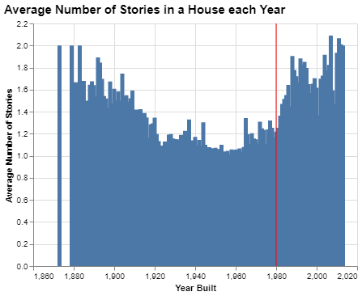
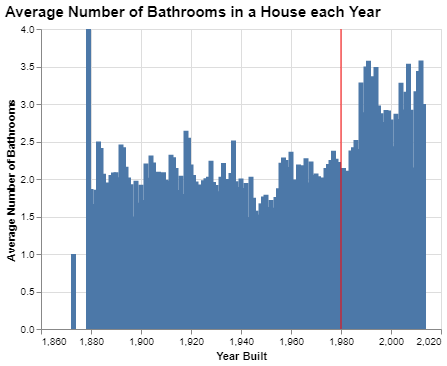
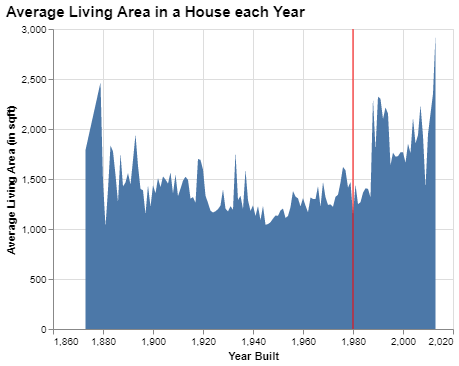
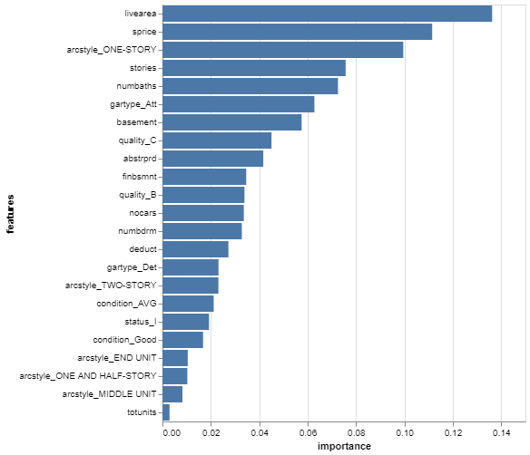
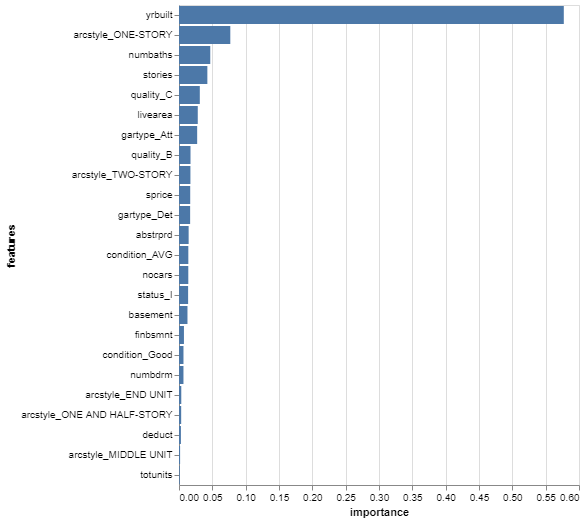
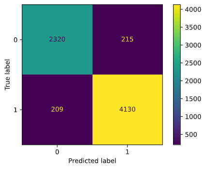

# Project 4: Can you predict that?

__JACOB FARR__

## Project Summary

_Used Scikit-Learn Machine Learning libraries to create classifier algorithms. Practiced on a machine-learning optimized data set of houses built throughout history. Used a classification model workflow to have the algorithm predict which houses were built before 1980. Workflow included splitting the data into features and targets, which were further split into test and train arrays. Trained a classifier model. Tested the model by making predictions. Measured the accuracy and feature importance assigned by classifier to improve algorithm accuracy._

## Technical Details

#### Grand Question 1
Create 2-3 charts that evaluate potential relationships between the home variables and before1980.







Each of these charts shows the averages for number of stories, number of bathrooms, and living area in a house increases after the year 1980.

#### Grand Question 2
*Can you build a classification model (labeling houses as being built before or after 1980) that has at least 90% accuracy? Explain your final model choice and describe what other models you tried.*

Yes, I was able to build a classification model with 93.8% accuracy, which accuracy percentage was calculated using sklearn .accuracy_score() method (check Appendix A for implementation). My final model choice was a RandomForestClassifier by sklearn. I tried using the GaussianNB classifier by sklearn, which averaged around 65% accuracy. Another was the DecisionTreeClassifier by sklearn, which landed around 85% accuracy. The same accuracy measure applies for the other two classifier I tried out, the GradientBoostingClassifier by sklearn and CatBoostClassifier by catboost. The bottom line is that all of these models can be good when used in the right circumstances and in the right way. The RandomForestClassifier just happened to be one of the classifiers to fit my needs of labeling houses as being built before or after 1980.

#### Grand Question 3
*Justify your classification model by discussing the most important features in your model. This dicussion should include a chart and a description of the features.*

Before getting into the chart, I should mention why the 'yrbuilt' feature was not included, seeing as this is the most important feature in the classification model. Whenever I included this feature, the classifier made 1.0 / 1.0 accuracy, or it was 100% accurate. For the sake of learning how to work without that feature, and to better learn the behavior of classifiers, I attempted to influence the classifier towards an above 90% accuracy without using the yrbuilt feature. I succeeded in producing 0.938 / 1.0 or 93.8% accuracy without including the yrbuilt feature, which is the most important feature in classifying whether a dwelling was build before of after 1980.

Now here are the features I did include in the classification model, in descending order of importance:



The top five important features are 'livearea', 'sprice', 'arcstyle_ONE-STORY', 'stories', and 'numbaths'. 'livearea' is the living area in sqft of the dwelling. 'sprice' is the selling price of the dwelling. 'arcstyle_ONE-STORY' is a boolean feature stating whether or not the dwelling is one story. 'stories' is the number of stories in the dwelling. 'numbaths' is the number of bathrooms in the dwelling.

Now here is the order of importance chart with yrbuilt included (1.0 / 1.0 or 100% accuracy):



As you can see, the most important feature in classifying whether a dwelling was built before1980 is the yrbuilt feature.

#### Grand Question 4
*Describe the quality of your classification model using 2-3 different evaluation metrics. You also need to explain how to interpret each of the evaluation metrics you use.*

ACCURACY

Calculated simply by using the sklearn.metrics method .accuracy_score(). Under the hood, (ACCURACY = (correct predictions / total number of test cases)). This is one of the easiest ways to evaluate the performance of a classifier model. According to the .accuracy_score() method, the ACCURACY of my model is 0.938 / 1.0 or 93.8% ACCURATE, so my classifier model is ACCURATE 93.8% of the time. Not too bad, but not perfect either!

CONFUSION MATRIX

The first evaluation metric is the CONFUSION MATRIX, shown below as a chart. The confusion matrix is broken up into four categories: True Negative (top left), True Positive (bottom right), False Negative (bottom left), False Positive (top right). The Positive categories show the number of predictions correct while the negative categories show the number of predictions incorrect. This matrix is not typically considered a metric on its own, but is used to calculate other metrics such as RECALL and PRECISION.



RECALL

Calculated simply by using the sklearn.metrics method classification_report(). Under the hood, (RECALL = (number of true positives / (number of true positives + number of false negatives))). RECALL is typically used to determine whether the data is mainly imbalanced, meaning there are significantly more of one target than another. Most machine learning algorithms and works best when the number of instances of each classes are roughly equal. When the number of instances of one class far exceeds the other, problems arise. In other words, RECALL is a number used to measure the balance of the classifier. According to the .classification_report() method, the RECALL of my model is 0.94 / 1.0 or 94% weighted average RECALL, so my classifier model is very well balanced!

PRECISION

Calculated simply by using the sklearn.metrics method classification_report(). Under the hood, (PRECISION = (number of true positives / (number of true positives + number of false positives))) PRECISION is typically used to measure the balance of the data. Most machine learning algorithms and works best when the number of instances of each classes are roughly equal. When the number of instances of one class far exceeds the other, problems arise. In other words, PRECISION is a number used to measure the balance of the classifier. According to the .classification_report() method, the PRECISION of my model is 0.94 / 1.0 or 94% weighted average PRECISION, so my classifier model is very well balanced!

F1-SCORE

Calculated simply by using the sklearn.metrics method classification_report(). In short, the F1-SCORE is the harmonic mean of PRECISION and RECALL, calculated as ((2*precision*recall) / (precision*recall)). It is a number to represent the average balance of a machine learning model. In the case of my model, the F1-SCORE is 0.94 / 1.0 or 94% weighted average PRECISION, so my classifier model is very well balanced!

In short, all evaluation metrics are simply ways to evaluate how effective your machine learning model is and evaluation metrics help you identify flaws in your model to be improved upon. 

## Appendix A

_The following Python script is ordered by the questions each script was written to answer._

#### Question 1
```python
#%%
# import packages
import pandas as pd
import numpy as np
import altair as alt
from sklearn.model_selection import train_test_split
from sklearn.metrics import accuracy_score

#%%
# import data
alt.data_transformers.disable_max_rows()

dwellings_denver_url = 'https://github.com/byuidatascience/data4dwellings/raw/master/data-raw/dwellings_denver/dwellings_denver.csv'
dwellings_ml_url = 'https://github.com/byuidatascience/data4dwellings/raw/master/data-raw/dwellings_ml/dwellings_ml.csv'
dwellings_neighborhoods_ml_url = 'https://github.com/byuidatascience/data4dwellings/raw/master/data-raw/dwellings_neighborhoods_ml/dwellings_neighborhoods_ml.csv'

dwellings_denver = pd.read_csv(dwellings_denver_url)
dwellings_ml = pd.read_csv(dwellings_ml_url)
dwellings_neighborhoods_ml = pd.read_csv(dwellings_neighborhoods_ml_url)

#%%
# what are we looking at?
dwellings_ml.columns

# GRAND QUESTION 1
# Create 2-3 charts that evaluate potential relationships between the home variables and before1980.

# Name the features (we only want unique data... no redundant or irrelevant features)
# Don't choose too many... could reduce the accuracy of the predictions.
# Only choose features you understand yourself.
# 'yrbuilt', 'sprice', 'stories', 'nocars', 'livearea','numbrdm','numbaths',

# Name the targets
# 'before1980'

#%%
# create a table for the charts
dwellings_table = (dwellings_ml
    .groupby('yrbuilt')
        .agg(
            sprice_avg = ('sprice', np.average),
            stories_avg = ('stories', np.average),
            nocars_avg = ('nocars', np.average),
            livearea_avg = ('livearea', np.average),
            numbdrm_avg = ('numbdrm', np.average),
            numbaths_avg = ('numbaths', np.average)
        )
        .filter(
            ['yrbuilt', 'sprice_avg', 'stories_avg', 'nocars_avg', 'livearea_avg', 'numbdrm_avg', 'numbaths_avg']
        )
        .reset_index()
    )

dwellings_table

#%%
# create an overlay chart to mark 1980
overlay = (alt.Chart(dwellings_table.query("yrbuilt == 1980"))
    .encode(
        # variables go here
            x = 'yrbuilt'
            # variables for .mark_point()
            #shape = 'year:N' # N = Nominal, O = Ordinal, (year is a variable)
            #color = 'name'
        )
    # attributes go here
    .mark_rule(color = 'red')
)

#%%
chart1 = alt.Chart(dwellings_table).mark_bar().encode(
    alt.X('yrbuilt', axis=alt.Axis(title="Year Built")),
    alt.Y('sprice_avg', axis=alt.Axis(title="Has Basement"))
).properties(
    title = {
        "text":"Average Selling Price of a House each Year",
    }
)

# overlay the charts to create a better chart
final_chart1 = (alt.layer(chart1, overlay)
    .configure_title(
        fontSize = 15,
        anchor = "start",
        subtitleFontSize = 11
    )
)

final_chart1

#%%
chart2 = alt.Chart(dwellings_table).mark_bar().encode(
    alt.X('yrbuilt', axis=alt.Axis(title="Year Built")),
    alt.Y('stories_avg', axis=alt.Axis(title=""))
).properties(
    title = {
        "text":"Average Number of Stories in a House each Year",
    }
)

# overlay the charts to create a better chart
final_chart2 = (alt.layer(chart2, overlay)
    .configure_title(
        fontSize = 15,
        anchor = "start",
        subtitleFontSize = 11
    )
)

final_chart2

#%%
chart3 = alt.Chart(dwellings_table).mark_bar().encode(
    alt.X('yrbuilt', axis=alt.Axis(title="Year Built")),
    alt.Y('nocars_avg', axis=alt.Axis(title=""))
).properties(
    title = {
        "text":"Average Number of Cars fitting in a House Garage Year",
    }
)

# overlay the charts to create a better chart
final_chart3 = (alt.layer(chart3, overlay)
    .configure_title(
        fontSize = 15,
        anchor = "start",
        subtitleFontSize = 11
    )
)

final_chart3

#%%
chart4 = alt.Chart(dwellings_table).mark_bar().encode(
    alt.X('yrbuilt', axis=alt.Axis(title="Year Built")),
    alt.Y('livearea_avg', axis=alt.Axis(title=""))
).properties(
    title = {
        "text":"Average Living Area in a House each Year",
    }
)

# overlay the charts to create a better chart
final_chart4 = (alt.layer(chart4, overlay)
    .configure_title(
        fontSize = 15,
        anchor = "start",
        subtitleFontSize = 11
    )
)

final_chart4

#%%
chart5 = alt.Chart(dwellings_table).mark_bar().encode(
    alt.X('yrbuilt', axis=alt.Axis(title="Year Built")),
    alt.Y('numbdrm_avg', axis=alt.Axis(title=""))
).properties(
    title = {
        "text":"Average Number of Bedrooms in a House each Year",
    }
)

# overlay the charts to create a better chart
final_chart5 = (alt.layer(chart5, overlay)
    .configure_title(
        fontSize = 15,
        anchor = "start",
        subtitleFontSize = 11
    )
)

final_chart5

#%%
chart6 = alt.Chart(dwellings_table).mark_bar().encode(
    alt.X('yrbuilt', axis=alt.Axis(title="Year Built")),
    alt.Y('numbaths_avg', axis=alt.Axis(title=""))
).properties(
    title = {
        "text":"Average Number of Bathrooms in a House each Year",
    }
)

# overlay the charts to create a better chart
final_chart6 = (alt.layer(chart6, overlay)
    .configure_title(
        fontSize = 15,
        anchor = "start",
        subtitleFontSize = 11
    )
)

final_chart6

```

#### Question 2
```python
# SUPERVISED MACHINE LEARNING

# EXERCISE 2
# Predict whether a house was built before1980.

#%%
# import packages
import pandas as pd
import numpy as np
import altair as alt
from sklearn.model_selection import train_test_split
from sklearn.ensemble import RandomForestClassifier
from sklearn.naive_bayes import GaussianNB
from sklearn.ensemble import GradientBoostingClassifier
from sklearn.tree import DecisionTreeClassifier
import catboost as cb # CatBoostClassifier
from sklearn import metrics

#%%
# import all data
dwellings_denver_url = 'https://github.com/byuidatascience/data4dwellings/raw/master/data-raw/dwellings_denver/dwellings_denver.csv'
dwellings_ml_url = 'https://github.com/byuidatascience/data4dwellings/raw/master/data-raw/dwellings_ml/dwellings_ml.csv'
dwellings_neighborhoods_ml_url = 'https://github.com/byuidatascience/data4dwellings/raw/master/data-raw/dwellings_neighborhoods_ml/dwellings_neighborhoods_ml.csv'

dwellings_denver = pd.read_csv(dwellings_denver_url)
dwellings_ml = pd.read_csv(dwellings_ml_url)
dwellings_neighborhoods_ml = pd.read_csv(dwellings_neighborhoods_ml_url)

#%%
dwellings_ml.describe()  # Summary statistics

#%%
'''
CLASSIFICATION MODEL 1 (GaussianNB)
'''

#%%
# SPLIT the dwellings_ml data into features and targets numpy arrays
# could also use .remove() to include everything except chosen features
features = dwellings_ml.filter(
    ['yrbuilt']
    ).to_numpy()
targets = dwellings_ml.filter(['before1980']).to_numpy()

#%%
# SPLIT the data into training and testing variables
# TODO: tinker with the split to see if attributes impact accuracy
features_train, features_test, targets_train, targets_test = train_test_split(features, targets, test_size=.3, random_state=42, stratify=targets)

#%%
# FIT (or train) the classifier model
# fit the classifier with the training data
# NOTE: why does targets_train request use of .ravel()?
classifier = GaussianNB()
classifier.fit(features_train, targets_train.ravel())

#%%
# TEST the classifier with a prediction using the test features
# in other words, guess which dwellings were built before1980 using these features
predictions = classifier.predict(features_test)

#%%
# COMPARE target_predictions with the actual values (targets_test)
metrics.accuracy_score(predictions, targets_test)

#%%
# print a matrix showing true and false predictions
# We want the top left and bottom right to be high (true predictions)
# We want the top right and bottom left to be low (false predictions)
print(metrics.confusion_matrix(targets_test, predictions))
#%%
# this matrix may be easier to read
print(pd.crosstab(targets_test.flatten(), predictions, rownames=['True'], colnames=['Predicted'], margins=True))

#%%
# print a matrix including RECALL, PRECISION, F1-SCORE
# best way to evaluate a model (provides all evaluation metrics)
# includes accuracy score, precision, recall, f1-score, and total predictions made
# (0 is negative predictions, 1 is positive predictions)
print(metrics.classification_report(targets_test, predictions))

# RECALL: The number of times you didn't get it right. (low is bad)
# PRECISION: The number of time you did get it right. (low is bad)
# F1-SCORE: The mean of PRECISION and RECALL

#%%
# visualize a confusion matrix
metrics.plot_confusion_matrix(classifier, features_test, targets_test)

#%%
'''
CLASSIFICATION MODEL 2 (RandomForestClassifier)
FINAL MODEL CHOICE
'''

#%%
# SPLIT the dwellings_ml data into features and targets numpy arrays
features = dwellings_ml.filter(
    ['sprice','stories','nocars',
    'livearea','basement','numbaths', 
    'numbdrm','totunits', 'arcstyle_SPLIT LEVEL']
    ).to_numpy()
targets = dwellings_ml.filter(['before1980']).to_numpy()

# SPLIT the data into training and testing variables
# TODO: tinker with the split to see if input attributes impact accuracy
features_train, features_test, targets_train, targets_test = train_test_split(features, targets, test_size=.3, random_state=24, stratify=None)

# TRAIN the classifier model
# fit the classifier with the training data
# NOTE: why does targets_train request use of .ravel()?
classifier = RandomForestClassifier(random_state=24)
classifier.fit(features_train, targets_train.ravel())

# TEST the classifier with a prediction using the test features
targets_predictions = classifier.predict(features_test)

#%%
# COMPARE target_predictions with the actual values (targets_test)
metrics.accuracy_score(targets_predictions, targets_test)

#%%
# print a matrix showing evaluation metrics?
print(metrics.confusion_matrix(targets_test, predictions))

#%%
'''
CLASSIFICATION MODEL 3 (DecisionTreeClassifier)
'''

#%%
# RUN the DecisionTreeClassifier

# SPLIT the data into features and targets numpy arrays
features = dwellings_ml.filter(
    ['sprice','stories','nocars',
    'livearea','basement','numbaths', 
    'numbdrm','totunits', 'arcstyle_SPLIT LEVEL']
    )
targets = dwellings_ml.filter(['before1980'])

# SPLIT the data into training and testing variables
# TODO: tinker with the split to see if input attributes impact accuracy
features_train, features_test, targets_train, targets_test = train_test_split(features, targets, test_size=.3, random_state=42, stratify=None)

# TRAIN the classifier model
# fit the classifier with the training data
# NOTE: why does targets_train request use of .ravel()?
classifier = DecisionTreeClassifier()
classifier.fit(features_train, targets_train)

# TEST the classifier with a prediction using the test features
predictions = classifier.predict(features_test)

#%%
# EVALUATE THE MODEL
# COMPARE target_predictions with the actual values (targets_test)
metrics.accuracy_score(predictions, targets_test)
#%%
# print a matrix showing true and false predictions
# We want the top left and bottom right to be high (true predictions)
# We want the top right and bottom left to be low (false predictions)
print(metrics.confusion_matrix(targets_test, predictions))

#%%
'''
CLASSIFICATION MODEL 4 (GradientBoostingClassifier)
'''

#%%
# RUN the GradientBoostingClassifier

# SPLIT the dwellings_ml data into features and targets numpy arrays
features = dwellings_ml.filter(
    ['sprice','stories','nocars',
    'livearea','basement','numbaths', 
    'numbdrm','totunits', 'arcstyle_SPLIT LEVEL']
    ).to_numpy()
targets = dwellings_ml.filter(['before1980']).to_numpy()

# SPLIT the data into training and testing variables
# TODO: tinker with the split to see if input attributes impact accuracy
features_train, features_test, targets_train, targets_test = train_test_split(features, targets, test_size=.3, random_state=42, stratify=None)

# TRAIN the classifier model
# fit the classifier with the training data
# NOTE: why does targets_train request use of .ravel()?
classifier = GradientBoostingClassifier(random_state=42)
classifier.fit(features_train, targets_train.ravel())

# TEST the classifier with a prediction using the test features
targets_predictions = classifier.predict(features_test)

#%%
# COMPARE target_predictions with the actual values (targets_test)
metrics.accuracy_score(targets_predictions, targets_test)

#%%
# print a matrix showing evaluation metrics?
print(metrics.confusion_matrix(targets_test, predictions))

#%%
'''
CLASSIFICATION MODEL 5 (CatBoostClassifier)
'''

#%%
# RUN the CatBoostClassifier

# SPLIT the dwellings_ml data into features and targets numpy arrays
features = dwellings_ml.filter(
    ['sprice','stories','nocars',
    'livearea','basement','numbaths', 
    'numbdrm','totunits', 'arcstyle_SPLIT LEVEL']
    ).to_numpy()
targets = dwellings_ml.filter(['before1980']).to_numpy()

# SPLIT the data into training and testing variables
# TODO: tinker with the split to see if input attributes impact accuracy
features_train, features_test, targets_train, targets_test = train_test_split(features, targets, test_size=.3, random_state=42, stratify=None)

# TRAIN the classifier model
# fit the classifier with the training data
# NOTE: why does targets_train request use of .ravel()?
classifier = cb.CatBoostClassifier(iterations=10,
                           depth=6,
                           learning_rate=1,
                           loss_function='Logloss',
                           verbose=False)
classifier.fit(features_train, targets_train)

# TEST the classifier with a prediction using the test features
predictions = classifier.predict(features_test)

#%%
# COMPARE target_predictions with the actual values (targets_test)
metrics.accuracy_score(predictions, targets_test)

#%%
# print a matrix showing evaluation metrics?
print(metrics.confusion_matrix(targets_test, predictions))
# %%

```

#### Questions 2, 3, and 4
```python
#%%
# import packages
import pandas as pd
import numpy as np
import altair as alt
from sklearn.model_selection import train_test_split
from sklearn.ensemble import RandomForestClassifier
from sklearn import metrics
from sklearn import tree

#%%
# import all data
dwellings_denver_url = 'https://github.com/byuidatascience/data4dwellings/raw/master/data-raw/dwellings_denver/dwellings_denver.csv'
dwellings_ml_url = 'https://github.com/byuidatascience/data4dwellings/raw/master/data-raw/dwellings_ml/dwellings_ml.csv'
dwellings_neighborhoods_ml_url = 'https://github.com/byuidatascience/data4dwellings/raw/master/data-raw/dwellings_neighborhoods_ml/dwellings_neighborhoods_ml.csv'

dwellings_denver = pd.read_csv(dwellings_denver_url)
dwellings_ml = pd.read_csv(dwellings_ml_url)
dwellings_neighborhoods_ml = pd.read_csv(dwellings_neighborhoods_ml_url)

# GRAND QUESTION 2
#%%
'''
CLASSIFICATION MODEL 2 (RandomForestClassifier)
FINAL MODEL CHOICE
'''

#%%
# SPLIT the dwellings_ml data into features and targets numpy arrays
# (if features include 'yrbuilt' then accuracy is 1.0 / 1.0 or 100%)
# (without 'yrbuilt', accuracy is 0.938 / 1.0 or 93.8%)
features = dwellings_ml.filter(
    ['sprice','stories','nocars',
    'livearea','basement','numbaths', 
    'numbdrm','arcstyle_END UNIT','arcstyle_MIDDLE UNIT',
    'arcstyle_ONE AND HALF-STORY','arcstyle_ONE-STORY','arcstyle_TWO-STORY',
    'status_I','gartype_Det','gartype_Att',
    'quality_C','quality_B','condition_Good',
    'condition_AVG','deduct','totunits',
    'finbsmnt','abstrprd']
    )
targets = dwellings_ml.filter(['before1980'])

# SPLIT the data into training and testing variables
# TODO: tinker with the split to see if input attributes impact accuracy
features_train, features_test, targets_train, targets_test = train_test_split(features, targets, test_size=.3, random_state=24, stratify=None)

# TRAIN the classifier model
# fit the classifier with the training data
# NOTE: why does targets_train request use of .ravel()?
classifier = RandomForestClassifier(random_state=42)
classifier.fit(features_train, targets_train)

# TEST the classifier with a prediction using the test features
predictions = classifier.predict(features_test)

# GRAND QUESTION 3

# %%
# PLOT FEATURE IMPORTANCE
feature_df = pd.DataFrame({'features':features.columns, 'importance':classifier.feature_importances_})
feature_df

feature_chart = alt.Chart(feature_df).mark_bar().encode(
    x = "importance",
    y = "features"
)
feature_chart

# GRAND QUESTION 4

# COMPARE target_predictions with the actual values (targets_test)
metrics.accuracy_score(predictions, targets_test)

#%%
# print a matrix showing evaluation metrics?
print(metrics.confusion_matrix(targets_test, predictions))

#%%
# this matrix may be easier to read
print(pd.crosstab(targets_test.flatten(), predictions, rownames=['True'], colnames=['Predicted'], margins=True))
#%%
# print a matrix including RECALL, PRECISION, F1-SCORE
# best way to evaluate a model (provides all evaluation metrics)
# includes accuracy score, precision, recall, f1-score, and total predictions made
# (0 is negative predictions, 1 is positive predictions)
print(metrics.classification_report(targets_test, predictions))
# RECALL: The number of times you didn't get it right. (low is bad)
# PRECISION: The number of time you did get it right. (low is bad)
# F1-SCORE: The mean of PRECISION and RECALL
#%%
# visualize a confusion matrix
metrics.plot_confusion_matrix(classifier, features_test, targets_test)

```